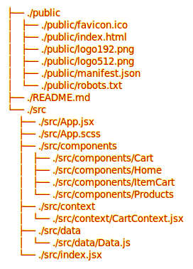
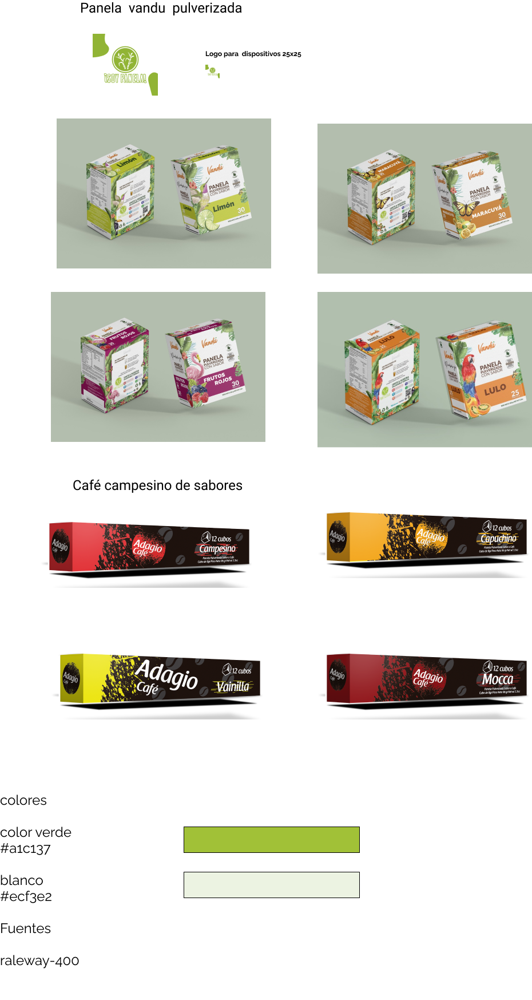
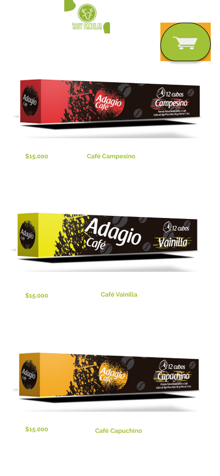
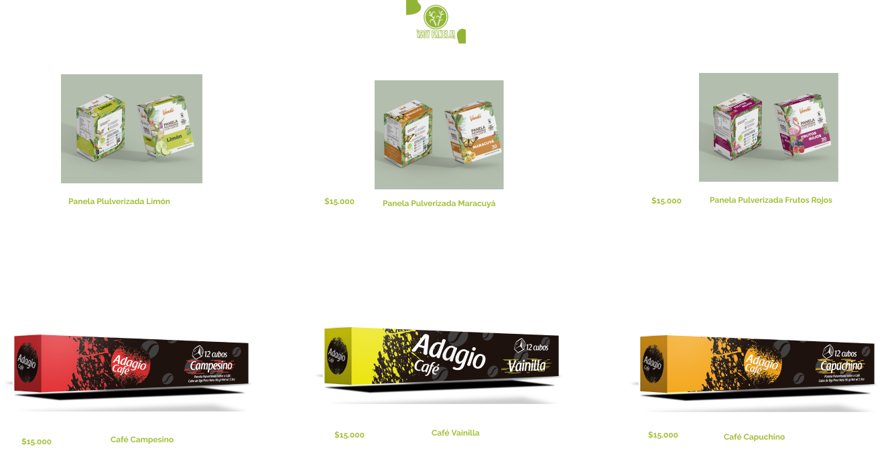
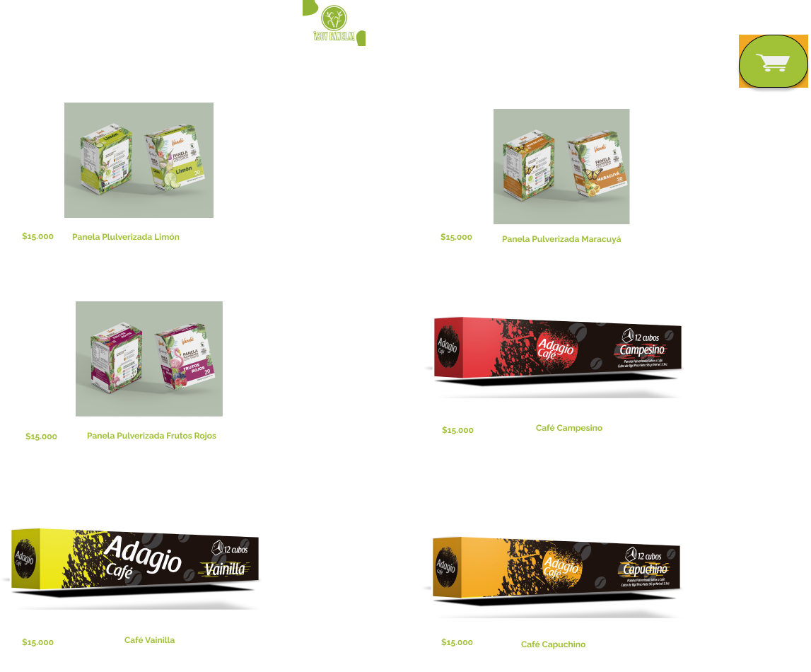

# ¡Un cliente real! 

 
 ⚙️detalles del proyecto

 Llegó el momento de interactuar con un cliente real para ello buscaremos un establecimiento de alimentos de nuestro sector y/o el emprendimiento de un amigo o familiar, ofrecemos nuestros servicios de Programadores y donaremos un desarrollo en React el cual será una interfaz interactiva que reciba los inputs del usuario y se los entregué al dueño del comercio como un pedido digital.

 

# 

   ⚙️Contexto del proyecto 

Este será tu primer reto profesional enfocado en un cliente real, tendrás que sacar tus habilidades de comunicación asertiva y tus habilidades de manejo de cliente.

#
Simultáneo a la práctica de estas habilidades blandas y ponerlas en un contexto real, evaluaremos el código para cumplir con las primeras tres competencias dedicadas al frontend de nuestro bootcamp en su nivel 3, también tendremos en cuenta la usabilidad e interactividad del usuario final.

#
Recuerda las recomendaciones que te hemos dado hasta este momento para recibir la competencia nivel 3.

# 

#

 ⚙️Requerimientos técnicos Generales:

#
#### Realizar un planning y product backlog respetando las fechas de las entregas

- Se requiere estudio previo del negocio del cliente

- Se requiere Mockup

- Se requiere Prototipo

- El desarrollo debe ser con React

- El desarrollo debe usar CSS para dar estilos, puedes hacer uso de alguna
librería

- El desarrollo debe contar con un carrito de compra (no es pasarela de pago)

- El desarrollo debe tener la funcionalidad de al finalizar el pedido, el establecimiento debe recibirlo a través de WhatsApp (debe incluir los productos, la cantidad de productos, el total de cada producto dependiendo de las unidades pedidas y el total de todo el pedido, si ves algún dato más relevante puedes agregarlo)

- El desarrollo debe estar en inglés al 100% menos para los strings que ve el usuario final pues estos deben estar en Español.

- El desarrollo debe contar con filtros de categorías para los diversos
productos

- El desarrollo debe contar con documentación técnica (debe ser bien
documentado para futuros mantenimientos o estabilidad)

- El desarrollo debe respetar la carta gráfica del cliente o la que ustedes le
propongan al cliente (en caso de no tenerla deben diseñar la carta gráfica
con logo, paletas de colores)

- El desarrollo debe ser RESPONSIVE con uso de la estrategia Mobile First
# 

#

 ⚙️ El desarrollo debe contar con las siguientes vistas:

Bienvenida a la tienda y descripción del negocio

Productos (acá se debe manejar el filtro de categorías)
Carrito de compras
Resúmen de las compras con botón para hacer el domicilio vía WhatsApp

# 

#

 ⚙️Requerimientos técnicos Productos: 

El desarrollo debe contar con filtros de categorías para los diversos productos
Los productos deben tener botones para agregar productos de uno en uno y también para quitarlos del carrito de compra

Mínimo 2 Categorías Mínimo 10 Productos

Los productos deben contar con características específicas

Los productos deben tener valores por unidad (si es por cantidad debe tener la especificación y la suma automática )

# 

#

⚙️Requerimientos técnicos Carrito de compras:

​El carrito debe mostrar la lista de productos seleccionados por el usuario final.

El carrito debe tener botones para agregar productos uno en uno y también para quitarlos del carrito de compra

El carrito debe mostrar la sumatoria del valor de todos los productos

El carrito debe tener un Botón de comprar que nos conduzca a WhatsApp para solicitar el domicilio trayendo toda la información del resumen del carrito de compra
​###
# 

#

 ⚙️Adicionales Opcionales:

#
- Pueden tener una vista del producto detallado.

- Aplicar más filtros si los productos y/o el comercio lo necesita.

- Pueden tener un formulario para recoger los datos del cliente antes de finalizar la compra, se pueden enviar todos los datos a whatsApp.

- Los productos pueden ser variables y/o con secciones de extras

- Pueden generar un QR imprimible que dirija al despliegue de la aplicación.

- Modalidades pedagógicas

- El desarrollo es de carácter individual.

- Implementación del diseño.

- Código limpio y funcionalidad del 100%

- Se tendrá en cuenta todos los requerimientos técnicos anteriormente mencionados.

- Como plus el dueño del negocio debe escribir una breve reseña de como le pareció el trato hacia el y su experiencia con la app.

- Criterios de rendimiento

- El Código debe ser limpio, ordenado y documentado

- El desarrollo debe ser 100% funcional

- El desarrollo debe ser Mobile First se debe usar la estrategia de diseño de interfaces de uso (UI) donde se inicia el proceso pensando primero en cómo va a aplicar a pantallas pequeñas (smart Phones o Móvil) y desde ahí hacer crecer el diseño para adaptarse a pantallas de mayor tamaño como tablets y ordenadores.

- La sustentación debe ser idónea y bien explicada

- Se debe realizar deploy

- La evaluación del código será a fondo del proyecto, este proyecto es nivel 3 así que solo validaremos la competencia si cumples con los requisitos y las buenas prácticas.

- También se evaluará el proceso con el cliente
Modalidades de evaluación

#
De manera individual y se tendrá en cuenta
- Gestión del cliente
- Procesos de creación, creatividad
- Manejo de estructura de carpetas
- Código y sustentación de funcionalidad

#
Entregables:

#
- Product Backlog
- Descripción del cliente en un documento PDF
- Mockup
- Prototipo
- Planteamientos de la estructura de Carpetas y la arquitectura del código para su funcionalidad PDF
- GitHub comentado y con el debido README
- Despliegue del proyecto funcional

#
NOTA: Todos los entregables se deben subir en las fechas dispuestas a continuación en SIMPLONLINE
#
# 

#

 🗓️Fechas de entregas 

#
- Lunes 28 de Febrero planteamiento del posible cliente (Nombre del negocio, descripción del negocio, definición de productos y categorías) y product backlog

- Martes 01 de Marzo Mockup completo de vistas en Móvil, Tablet, Escritorio

- Miércoles 02 de Marzo Prototipo completo de vistas en Móvil, Tablet, Escritorio (si es posible conseguir feedback del cliente sería lo ideal)

- Jueves 03 de Febrero Planteamientos de la estructura de Carpetas y la arquitectura del código para su funcionalidad (Un escrito en PDF)

- Viernes 04 de Marzo Inicio de código

- Lunes 07 de Marzo Seguimiento de avances en el proyecto

- Viernes 11 de Marzo Entrega Final del proyecto desplegado (Deploy) y GitHub (repositorio) en Simplonline y entrega al cliente.

# 

#

 Estrutura de directorios 

# 

#

 Cliente Soypanel 

# 

#

Moockup 

# 

#

 
 Movil 

 

# 

#

 
 Tablet 

 

# 

#

 
 Desktop

 

# 

#

 
 links proyect 

#

[Repository](https://github.com/dariohimo/unClienteReal.git "unClienteReal")

#

[Un cliente real](https://unclientereal.dariohimo.repl.co/ "Soypanela")

# 

#
---
 @dariohimo Marzo, 2022
___